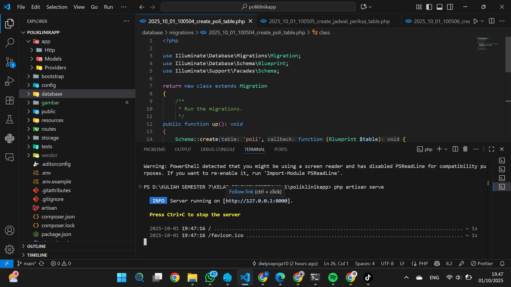

## ⚙️ Lingkungan Pengembangan: Laragon, Composer, & VS Code

Pada modul ini, dijelaskan bahwa langkah awal adalah melakukan instalasi **XAMPP** sebagai lingkungan pengembangan.  
Namun, saya menggunakan **Laragon** sebagai pengganti XAMPP karena beberapa alasan berikut:

- ✅ **Lebih ringan dan cepat** saat dijalankan  
- ⚙️ **Otomatis mendeteksi virtual host** tanpa konfigurasi manual  
- 🔄 **Mendukung berbagai versi PHP** dengan mudah  
- 💡 **Integrasi baik dengan Composer & Laravel**

> 💡 Laragon telah berhasil diinstal dan dikonfigurasi di perangkat saya.  
> Berikut tampilan dan pengaturannya dapat dilihat pada screenshot di bawah ini.

  

---

Selain itu, saya juga telah menginstal **Composer** sebagai dependency manager untuk Laravel, serta **Visual Studio Code (VS Code)** sebagai text editor utama dalam pengembangan proyek.

> 🧩 Berikut adalah tampilan instalasi **Composer** dan **VS Code**:

  

  

