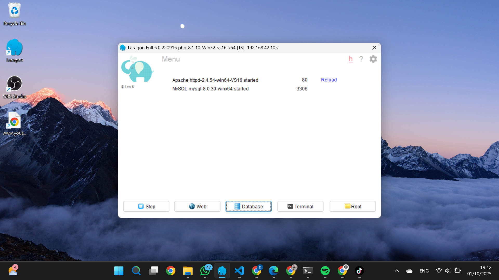
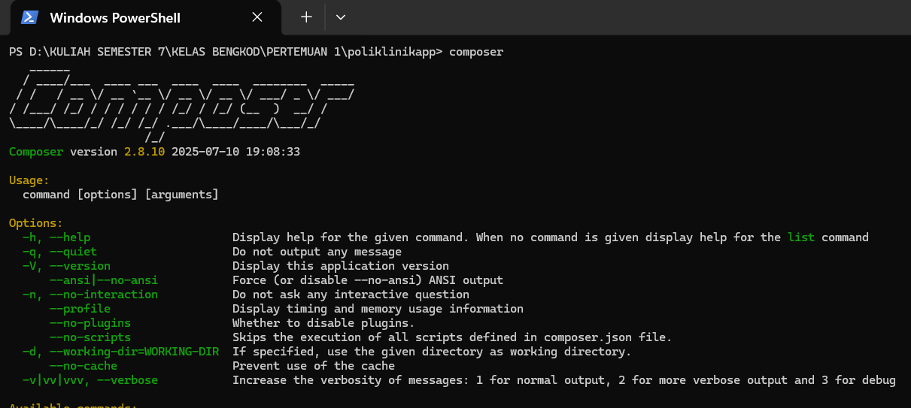
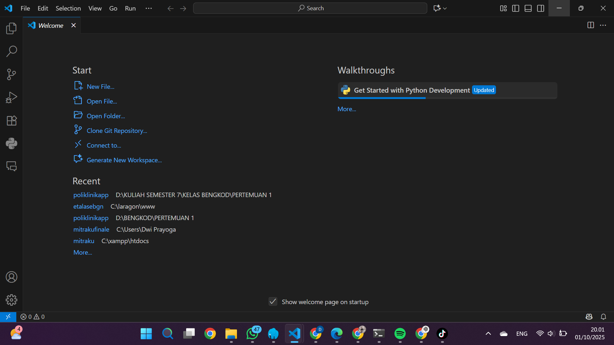
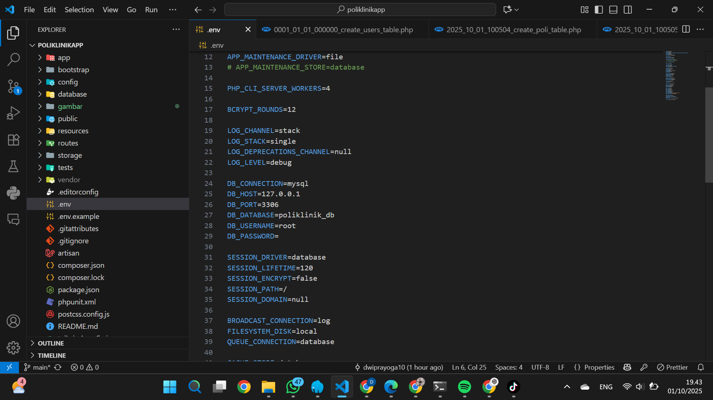
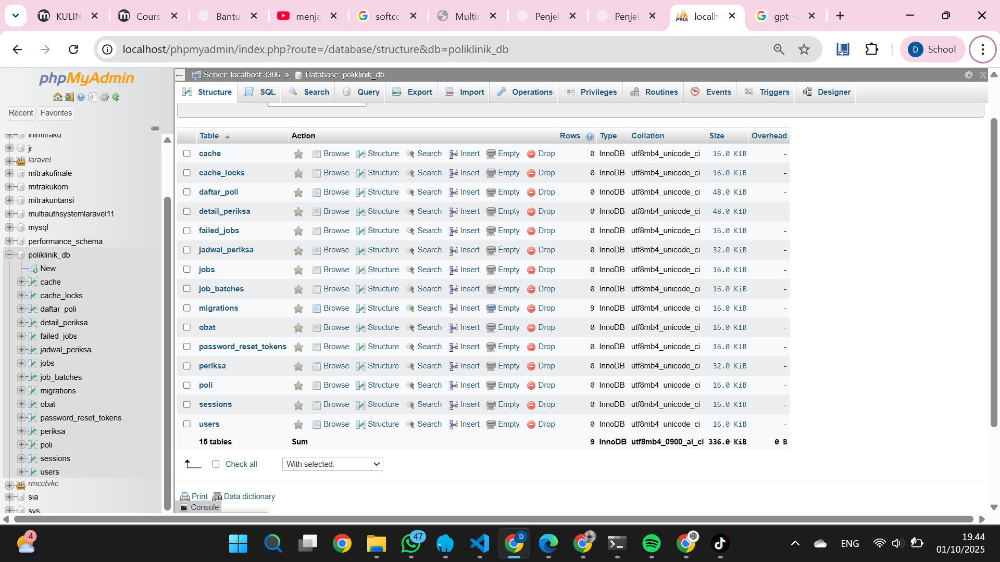
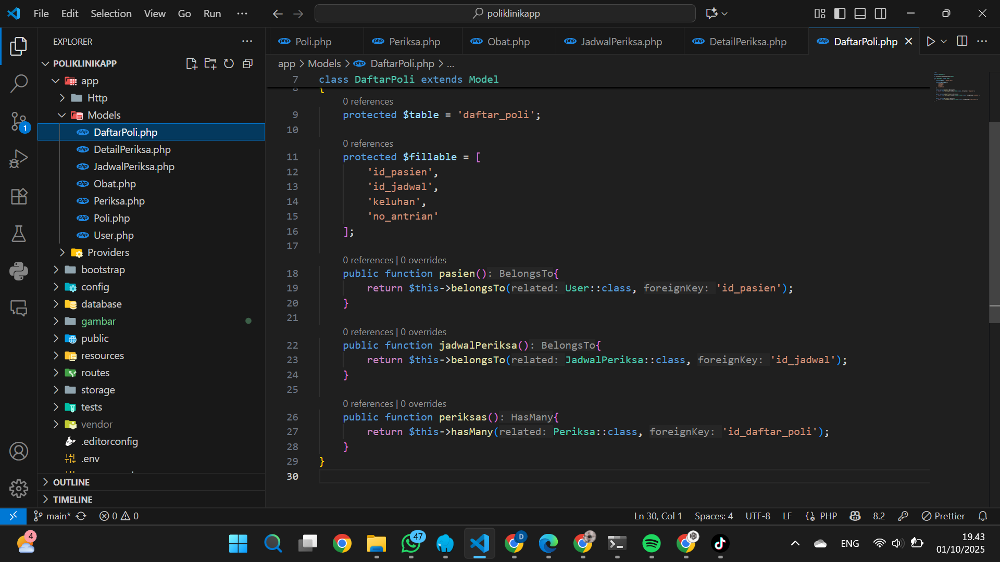
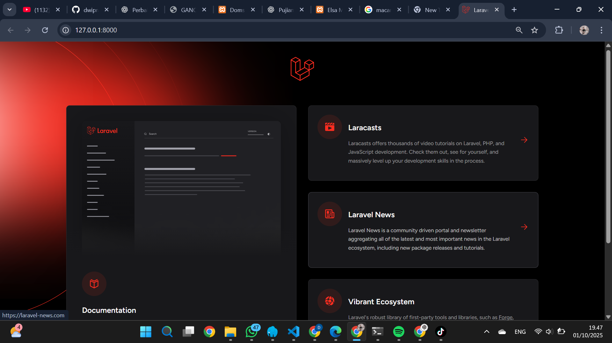

<h1 align="center">Praktikum Bengkel Koding - Laravel</h1>

  Modul 1–3 | Pengenalan Laravel, Desain Database, Migrasi, dan Relasi Eloquent

---

## ⚙️ Lingkungan Pengembangan: Laragon, Composer, & VS Code

Pada modul ini, dijelaskan bahwa langkah awal adalah melakukan instalasi **XAMPP** sebagai lingkungan pengembangan.  
Namun, saya menggunakan **Laragon** sebagai pengganti XAMPP karena lebih **ringan**, **otomatis mendeteksi virtual host**, dan **mendukung Laravel dengan baik**.

> Laragon telah berhasil diinstal dan dikonfigurasi di perangkat saya.  
> Berikut tampilan dan pengaturannya dapat dilihat pada screenshot di bawah ini.

  

---

Selain itu, saya juga telah menginstal **Composer** sebagai dependency manager untuk Laravel, serta **Visual Studio Code (VS Code)** sebagai text editor utama dalam pengembangan proyek.

> Berikut adalah tampilan instalasi **Composer** dan **VS Code**:

  

  

---

## 🧱 Modul 2: Desain Database & Migrasi Laravel

Pada modul ini, saya telah mengikuti seluruh langkah-langkah yang dijelaskan mengenai **Desain Database** dan **Migrasi di Laravel**.  
Proses ini meliputi pembuatan struktur tabel menggunakan migrasi dan pengecekan hasilnya di database.

> Berikut adalah bukti bahwa saya telah menyelesaikan modul ini, yang ditunjukkan melalui screenshot di bawah.

  

  

---

## 🔗 Modul 3: Membuat Model dan Relasi Eloquent

Pada modul ini, saya telah mengikuti seluruh tahapan dalam pembuatan **Model** dan penerapan **Relasi Eloquent** di Laravel.  
Relasi Eloquent digunakan untuk menghubungkan antar tabel dalam database dengan cara yang efisien, rapi, dan terstruktur.

> Berikut adalah bukti bahwa saya telah menyelesaikan modul ini, ditunjukkan melalui screenshot di bawah.

  

  

---

  <i>Dokumentasi ini disusun sebagai bukti partisipasi dalam Praktikum Bengkel Koding - Laravel.</i>

